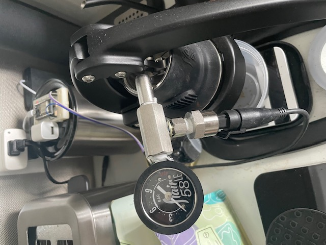
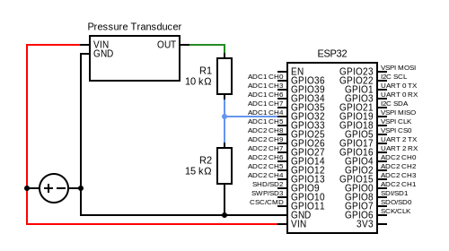
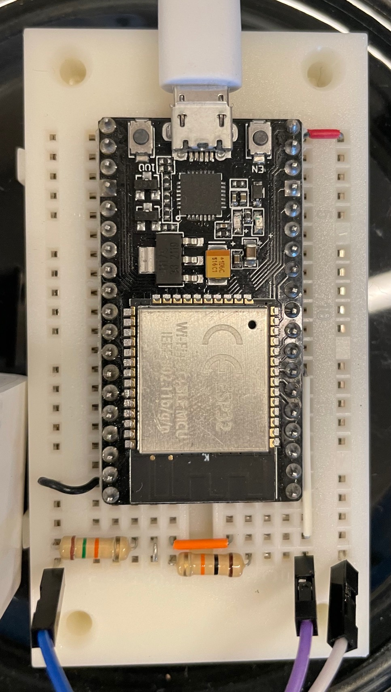

# Open Espresso Profiler

A DIY alternative to commercial BLE sensors for Espresso pressure profiling.
Based on the ESP32 and off-the-shelf components.

Compatible with BeanConqueror and Pressensor CoffeFlow apps.

## Hardware

### Shopping list

This list below contains links to the parts that I bought. Total part cost comes out to around $80, but you can save a little bit by getting rid of the Tee fitting setup (not recommended if you ever need to calibrate your pressure sensor).

* ESP32 - I used ESP-WROOM-32 dev boards, but any should be workable
  * [38 Pin Narrow - Pack of 2](https://www.amazon.com/gp/product/B07QCP2451) - Fits a little better on a standard breadboard
  * [30 pin - Pack of 3](https://www.amazon.com/gp/product/B08D5ZD528) - Has pin numbers silk-screened on top
* Pressure Transducer - Must be capable of reading **at least** 150 PSI and run on 5V.
  * [200 PSI - 1/8" NPT](https://www.amazon.com/gp/product/B00NIK900K)
* Fittings for Flair58 - The stock gauge uses G1/8 fittings, which should be equivalent to 1/8" BSPP
  * [1/8" NPT to 1/8" BSPP](https://www.amazon.com/gp/product/B01LQU8FV8) - Adapter in case you bought an 1/8" NPT transducer like I did.
  * [1/8" BSPT Tee Adapter](https://www.amazon.com/gp/product/B07PK9JHQM) - Probably not the right thread, but this is what I bought. We really want BSPP (not BSPT) on either end.
  * [PTFE Tape](https://www.amazon.com/gp/product/B003D7K8E0) - Useful to help seal up leaky connector fittings.
* Electronics Misc
  * [Dupont wires](https://www.amazon.com/gp/product/B01EV70C78) - Useful for prototyping. I soldered the transducer's included cables to some pin headers to make (dis)connecting easier. Considering crimping them into a three-wire connector.
  * [Breadboard](https://www.amazon.com/gp/product/B07PCJP9DY) - Might want to get a few colored spools of solid strand wire to keep things tidy.
  * [Resistors](https://www.amazon.com/gp/product/B08FHPKF9V) - Really only need a 10k and a 15k Ohm resistor
* Optional - quality of life stuff
  * [Outlet extender with USB](https://www.amazon.com/gp/product/B09PGXWNWG) - This lets me power an OEP off of the same outlet as my Flair 58. Combine with a smart outlet and Home Assistant for auto power off, too.
  * Dupont connectors and crimper - make the transducer wires easier to quickly connect
* Tools
  * Soldering Iron
  * Wire cutter / stripper

Planning to calibrate your own transducer? These tools might also be useful:

* Multimeter
* [58mm back flush disc](https://www.amazon.com/gp/product/B07DLYGJPH)

### Wiring it up

The ESP32's built-in ADC can only read up to about 3.3V, so we need to step down the voltage coming from our transducer's output pin.
I've opted for a simple voltage divider using 15k Ohm and 10k Ohm resistors to go from 5V to 3V reference.

Be sure to put the resistors in the correct order when wiring it up. The lower resistance should be between the transducer and the ADC pin.

If you need to use a different pin for analog readings, make sure to consult the ESP32 documentation to see which pins are connected to ADC1.
We may choose to implement some Wi-Fi functionality in the future, which would disable ADC2.

## Software

### Building and Flashing

1. Install [PlatformIO](https://platformio.org/)
2. Plug in your ESP32 and update the `upload_port` in [platformio.ini](./platformio.ini)
3. Edit [config.h](./src/config.h) to match your setup
4. Build and upload by running the following command in this directory:
`platformio run -e espwroom32 -t upload`

## What's next?
* 3D-printed Case
* Web-based UI
  * Web Bluetooth connection to this (and other) BLE pressure sensors
  * Smart Scale support (targeting Acaia Lunar first)
  * Import from visualizer.coffee/BeanConqueror/CoffeeFlow/Decent/etc
  * Overlay imported profiles on graph
  * Export to other apps and sync to Cloud/NAS

* Publish to MQTT or direct export to time-series DBs
